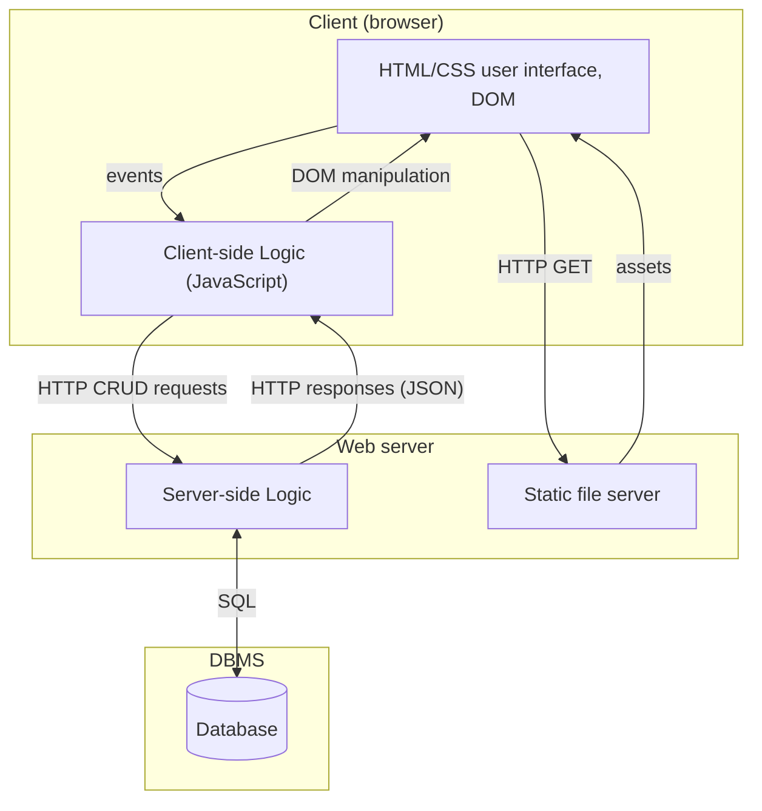
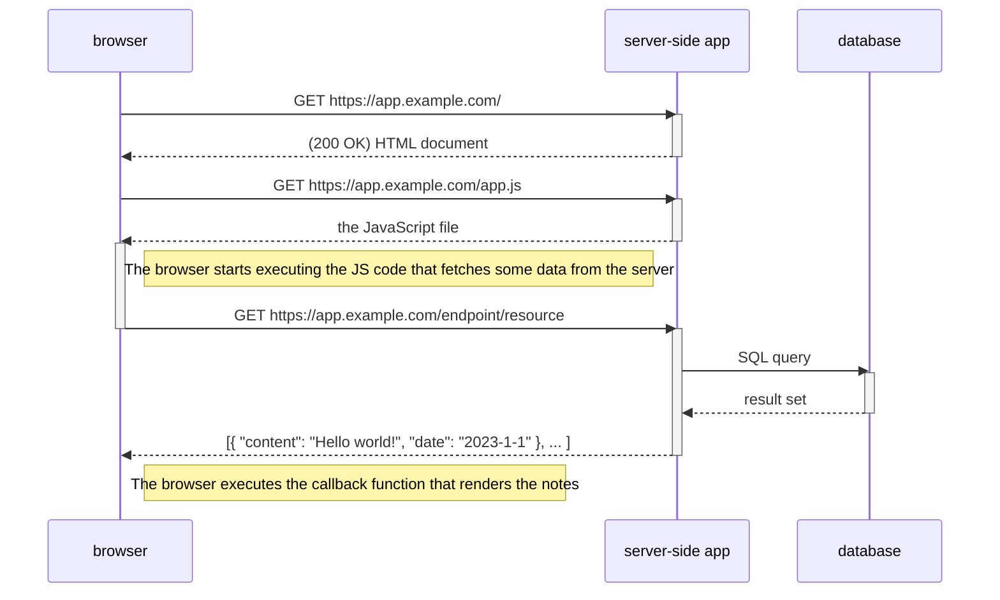

# Getting started with server-side development

## Architecture and concepts

Typical client-server architecture in web applications



1. The client, which can be a user's device (e.g., computer or smartphone) with a web browser, connects to the server over the internet.
   - The _Hypertext Transfer Protocol (HTTP)_ is commonly used for communication between the client and server.
1. Web browser (the Client) loads HTML, CSS, JavaScript, images and other static UI files from the server using HTTP **GET** requests.
1. The user interacts with the user interface on the client side.
1. Based on the interaction, the Client-side Logic prepares a request to send to the server.
1. The _request_ for a _resource_ is sent to the Server.
   - Requests can be of various types, such as **GET**, **POST**, **PUT**, **DELETE**, etc., depending on the action being performed.
   - Resources are identified using **URLs** (Uniform Resource Locators).
1. On the server side, the server-side logic processes the request. This may involve querying a database or performing other operations.
   - Web applications store and retrieve data using databases like MySQL, PostgreSQL, or MongoDB.
   - Back-end code interacts with the database to perform operations like storing, updating, and retrieving information.
1. The server generates a response and sends it back to the client. The response can be in the form of HTML, CSS, JavaScript, or data in other formats like **JSON** or XML.
1. The client (JavaScript code run by the browser) processes the response, updating the User Interface or performing other actions as necessary. This mechanism is often referred to as "Client-Side Rendering".
1. Users continue to interact with the web application and trigger new HTTP requests, which the server processes to provide the desired data.
   - Users interact with the web application by performing actions like clicking buttons or submitting forms.
   - These interactions trigger new requests from the client to the server, creating a continuous cycle of interaction.



## HTTP request


```http
POST /index.html HTTP/1.1
Host: example.com
User-Agent: Mozilla/5.0 (Windows NT 10.0; Win64; x64) AppleWebKit/537.36 (KHTML, like Gecko) Chrome/91.0.4472.124 Safari/537.36
Accept: text/html,application/xhtml+xml
Accept-Language: en-US,en;q=0.9
Content-Type: application/json

{"username": "frank", "password": "12345"}
```

- **POST**: The HTTP method used to retrieve a resource.
- **/index.html**: The path of the resource we want to retrieve.
- **HTTP/1.1**: The version of the HTTP protocol being used.
- **Host: example.com**: The hostname of the server where the resource is located.
- **User-Agent**: The user agent string identifying the client.
- **Accept**: The types of content the client can understand.
- **Accept-Language**: The preferred languages for the response.
- **Content-Type**: Tell what kind of data is in the body.
- **Body**: for sending data with POST and PUT methods

### HTTP methods

Common HTTP request methods include:

- **GET**: Retrieve data from the server (e.g., a web page or API endpoint).
- **POST**: Send data to the server to create a new resource (e.g., submitting a form).
- **PUT**: Update an existing resource on the server.
- **DELETE**: Remove a resource from the server.

---

## HTTP response


```http
HTTP/1.1 200 OK
Server: Apache/2.4.41 (Unix)
Content-Type: text/html
Content-Length: 1234
Date: Sat, 10 Jun 2023 15:30:00 GMT

<!DOCTYPE html>
<html>
<head>
  <title>Example Website</title>
</head>
<body>
  <h1>Welcome to the Example Website!</h1>
  <p>This is the content of the index.html file.</p>
</body>
</html>
```

- **HTTP/1.1 200 OK**: Successful response with status code 200 and message OK.
- **Server: Apache/2.4.41 (Unix)**: Server software and version.
- **Content-Type: text/html**: Content type of the response is HTML.
- **Content-Length: 1234**: Length of the response content in bytes.
- **Date: Sat, 10 Jun 2023 15:30:00 GMT**: Date and time of response generation.
- **Response Body**: The body of the HTTP response comes after two line brakes and contains the actual content being sent back to the client.

---

### HTTP response with an image (or any binary file)

```http
HTTP/1.1 200 OK
Server: Apache/2.4.41 (Unix)
Content-Type: image/jpeg
Content-Length: 12345
Date: Sat, 10 Jun 2023 15:30:00 GMT

[Binary data representing the JPG image]
```

### Status codes

HTTP status codes are issued by a server in response to a client's request made to the server. They help the client understand the result of their request. Status codes are grouped into five classes:

- **1xx (Informational)**: The request was received, and the process is continuing.
- **2xx (Successful)**: The request was successfully received, understood, and accepted.
  - **200 OK**: The request has succeeded. The meaning of the success depends on the HTTP method used.
  - **201 Created**: The request has been fulfilled and has resulted in the creation of a new resource.
- **3xx (Redirection)**: Further action needs to be taken by the user agent to fulfill the request.
  - **301 Moved Permanently**: The requested resource has been assigned a new permanent URI.
  - **302 Found**: The requested resource resides temporarily under a different URI.
- **4xx (Client Error)**: The request contains bad syntax or cannot be fulfilled.
  - **400 Bad Request**: The server could not understand the request due to invalid syntax.
  - **401 Unauthorized**: The client must authenticate itself to get the requested response.
  - **403 Forbidden**: The client does not have access rights to the content.
  - **404 Not Found**: The server can not find the requested resource.
- **5xx (Server Error)**: The server failed to fulfill an apparently valid request.
  - **500 Internal Server Error**: The server has encountered a situation it doesn't know how to handle.
  - **502 Bad Gateway**: The server, while acting as a gateway or proxy, received an invalid response from the upstream server.
  - **503 Service Unavailable**: The server is not ready to handle the request, often due to maintenance or overload.

More information on [HTTP status code](https://developer.mozilla.org/en-US/docs/Web/HTTP/Status) in the Mozilla Developer Network documentation.

## REST

**Re**presentational **S**tate **T**ransfer, is an architectural style for designing distributed systems. REST is often used in the context of web services, especially when building APIs. RESTful architecture is based on HTTP protocol. In this course we build a REST interface for client-server communication.

Common principles of RESTful architecture:

- **Stateless Communication**: Each request from a client to a server must contain all the information needed to understand and process the request. The server should not retain any client state between requests. This makes it easier to scale, as there's no session information to manage between requests.
- **Client-Server**: The client and server are separate entities that communicate over a network. The client is responsible for the user interface and user experience, while the server is responsible for processing requests, managing data, and executing most of the business logic.
- **Cacheability**: Responses from the server can be labeled as cacheable or non-cacheable. When a response is cacheable, clients can reuse it for equivalent requests in the future, leading to better performance and reduced server load. Responses from the server should clearly indicate their cacheability to help clients understand when a resource's representation is fresh and when it needs to be re-requested.
- **Uniform Interface** simplifies and decouples the architecture, allowing each part to evolve independently. Constraints that define this uniform interface include:
  - **Resource Identification**: Each resource (like a user, product, etc.) is identified by a unique URI (Uniform Resource Identifier). e.g. `https://example.com/resource/id`
  - **Resource Manipulation through Representations**: Clients interact with resources by getting and modifying their representations (usually in formats like **JSON** or XML).
  - **Self-descriptive Messages**: Each message contains enough information about how to process the message (e.g., using HTTP methods and status codes).
- **HTTP Methods**: In the context of web services and APIs, REST usually relies on [standard HTTP methods](#http-methods).
- **HTTP Status Codes:** Each response is served with an appropriate [HTTP status code](#status-codes).

REST APIs are popular due to their simplicity, scalability, and performance. When an API adheres to these principles, it's often referred to as a "RESTful" API.

## Server-side technologies

Programming language + application framework + database + runtime environment (server) = server-side (back-end) application

- Programming language is a tool for writing code, specifying algorithms, and instructing a computer.
  - Languages like JavaScript, Python, PHP, Java, C#, Ruby, Go, and Rust are commonly used for server-side web development.
- Framework is a higher-level structural foundation that provides guidelines, pre-written code, and tools for building applications in a specific domain. Developers often use programming languages within the context of a framework to streamline the development process and adhere to best practices for a particular type of application, such as web development or mobile app development.
- Running environment, often referred to as the "runtime environment" or simply the "runtime," is the software and hardware infrastructure where the server-side code of an application executes. This environment provides the necessary resources and services for the server-side code to run, handle requests, process data, and generate responses.
- All permanent data used by the application itself or saved by the users of the application is stored in the database
- Relational databases like MySQL, PostgreSQL, and NoSQL databases like MongoDB, Cassandra, and Redis are commonly used for storing and retrieving data in web applications.

### JavaScript and Node.js

- JavaScript is a high-level, often just-in-time compiled language that follows the [ECMAScript standard](https://www.ecma-international.org/publications-and-standards/standards/ecma-262/).
- The ECMAScript standard does not include any input/output (I/O), such as networking, storage, text, or graphics. In practice, the web browser or other runtime system provides APIs for I/O.
- Node.js is a popular runtime environment that allows developers to write server-side code in JavaScript. It is known for its non-blocking, event-driven architecture, making it well-suited for building scalable and high-performance web applications.
- Express.js is a minimal and flexible Node.js web application framework that provides a robust set of features for building web and mobile applications. It is often used for creating RESTful APIs.

---

## Tools and Development Environment

### Code editor or IDE

Ultimately, it's your choice. VSCode is used by the teachers.

#### [Visual Studio Code (VSCode)](https://code.visualstudio.com/download)

- free & open source code editor by Microsoft (**!=** Visual Studio IDE)
- wide extension support
- lightweight, multiplatform support
- good [docs & instructions](https://code.visualstudio.com/docs/editor/codebasics)
- choice of many Web developers

**Install Extensions:** Press _ctrl-shift-x_ or click extensions icon on the left panel. Search and install:

- Prettier
- EditorConfig for VS Code
- Auto Import
- ESLint

##### Basic Usage

Active **project** is the folder open on the left side panel (_File -> Open folder..._)

Handy keyboard shortcuts (finnish layout, check _File -> Preferences -> Keyboard shortcuts_ for more)

- Multiline comment: _ctrl-'_
- Delete line: _ctrl-shift-k_
- Move line(s): _alt-up/down_
- Copy line(s): _alt-shift-up/down_
- Auto format code: _alt-shift-f_
- Open integrated console: _ctrl-ö_
- Quick find/open files: _ctrl-p_
- Split editor: _ctrl-§_

### Operating system terminal (command line)

- Windows:
  - use Git Bash (included in [Git](https://gitforwindows.org/) installation)
  - or built-in: Click on the start or search icon and type "PowerShell" in the search box
- Mac: press command-space to open search then type 'Terminal'

### Node.js

Install latest [Node.js LTS version](https://nodejs.org/en)

- A JavaScript runtime built on Chrome's V8 JavaScript engine.
- Uses an event-driven, non-blocking I/O model that makes it lightweight and efficient.
- Node.js package ecosystem, npm, is the largest ecosystem of open source libraries in the world.

Usage, running a javascript file locally without a web browser:

```sh
node my-script.js
```

### [npm](https://www.npmjs.com/)

- npm is the package manager for the Node JavaScript platform and is installed with Node.js.
- npm consists of a command line client and an online database of public and paid-for private packages, called the npm registry.
- npm packages needed in a project (dependencies) are listed in the `package.json` file and can be install with `npm install` command.
- locally installed (=project specific) packages are downloaded to `node_modules/` folder (should be excluded from version control).

### Other tools needed

- For source code management [Git](https://github.com/mattpe/git-intro/blob/main/git-basics.md)
- [Postman](https://www.postman.com/), Postman [VS Code extension](https://marketplace.visualstudio.com/items?itemName=Postman.postman-for-vscode) or VS Code [REST Client](https://marketplace.visualstudio.com/items?itemName=humao.rest-client) extension
- A Relational database management system, _DBMS_ (MariaDB or MySql), [Some install instructions](https://gist.github.com/mattpe/b8decf207ef8df9d17d04c1361de9864)

---

### Formatting and Linting

- Formatters and linters help maintain code quality and consistency.
- Formatters automatically format code according to predefined rules, ensuring a standardized and uniform code style
  across a project.
- Formatters handle tasks such as indentation, spacing, and line breaks, making code more readable and easier to
  understand.
- Linters have two categories of rules:
  - **Formatting rules**: enforce code style and formatting conventions. (Formatter fixes these automatically.)
  - **Code quality rules**: analyze code for potential errors, bugs, and violations of coding standards and conventions. (Formatter does nothing to help with those kind of rules.)
- Linters enforce best practices, identify potential issues, and provide suggestions for improvement.
- Formatters and linters together play a vital role in promoting code quality, reducing bugs, and facilitating
  collaboration among developers working on the same project.

#### Formatters

- Automatically format code according to predefined rules.
- Ensure a standardized and uniform code style across a project.
- Handle tasks such as indentation, spacing, and line breaks.
- Improve code readability and understandability.

#### Linters

- Analyze code for potential errors, bugs, and violations of coding conventions.
- Enforce best practices and coding standards.
- Identify potential issues and provide suggestions for improvement.
- Facilitate the detection of common programming mistakes.

Both formatters and linters contribute to maintaining code quality and consistency, but they focus on different aspects
of the development process. Formatters primarily deal with code formatting and style, while linters primarily focus on
code analysis and identifying potential issues.

### [EditorConfig](https://editorconfig.org/)

- is a file format and tool that helps maintain consistent coding styles across different code editors and IDEs.
- provides a way to define and enforce coding style preferences such as indentation, line endings, encoding, and
  whitespace rules.
- supports a wide range of programming languages and can be used with various code editors and IDEs, including Visual
  Studio Code, Sublime Text, and JetBrains IDEs.
- can be combined with other tools like ESLint and Prettier to create a comprehensive code styling and formatting setup
  in your development workflow.

```conf
# sample .editorconfig

# Top-most EditorConfig file
root = true

# File encoding
[*]
charset = utf-8

# Indentation settings
[*.{js,mjs}]
indent_style = space
indent_size = 2

[*.css]
indent_style = space
indent_size = 2

[*.html]
indent_style = space
indent_size = 2

# Line endings
[*]
end_of_line = lf

# Trailing whitespace
[*]
trim_trailing_whitespace = true

# New line at the end of the file
[*]
insert_final_newline = true

# Maximum line length
[*.{js,mjs,css,html}]
max_line_length = 80
```

### [Prettier](https://prettier.io/)

- is a popular code formatter that helps ensure consistent code style across projects.
- automatically formats code based on a set of predefined rules, eliminating the need for manual formatting.
- supports various programming languages, including JavaScript, TypeScript, CSS, HTML, and more.
- enforces a consistent code style by handling tasks such as indentation, spacing, line breaks, and wrapping.
- provides configuration options to customize the formatting rules according to project requirements.
- helps maintain code readability and improves code maintainability by providing a consistent and clean codebase.

```json
// sample .prettierrc.json 
{
  "semi": true,
  "singleQuote": true,
  "bracketSpacing": false,
  "trailingComma": "es5"
}
```

### [ESLint](https://eslint.org/)

- is a widely used linter for JavaScript and TypeScript that helps identify and enforce coding conventions, best
  practices, and potential errors in code.
- analyzes code statically and provides warnings or errors for common programming mistakes, potential bugs, and
  violations of coding standards.
- offers a highly configurable [rule set](https://eslint.org/docs/latest/use/configure/rules) that allows developers to customize the linting rules according to their
  project's specific requirements.
- supports various plugins and extensions, allowing for additional rules and language-specific linting capabilities.
- enables collaboration among team members by providing a shared set of rules and standards for writing clean and
  error-free code.
- offers the ability to automatically fix certain linting issues, saving developers time and effort in resolving common
  code problems.
- supports JavaScript ecosystem frameworks and libraries.

---

### Setting up front-end (client) web development environment using Vite

[Vite](https://vitejs.dev/guide/)

1. Create a new project with Vite in terminal

   ```sh
   # cd to your code folder
   npm create vite@latest
   # 1. type your project name
   # 2. Select a framework: -> Vanilla
   # 3. Select a variant: -> Javascript
   cd <project-name>
   npm install
   # start vite dev server
   npm run dev
   ```

1. Open the preview URL (<http://localhost:5173/>) in your browser and open developer tools (e.g. Chrome & [Chrome DevTools](https://developers.google.com/web/tools/chrome-devtools/))
1. Open the project folder in VS Code
1. To get started with a clean web app template:
   - edit or replace `index.html` file but do not remove `<script type="module" src="/main.js"></script>`
   - edit or replace `style.css` with your own styles
   - edit `main.js` file (note that the css file is imported in the js file instead of the html file `import './style.css';`). Everything else boilerplate code can be removed from the js file.
   - remove `counter.js` and image files because they are just examples

#### Publishing the website created with Vite

1. Stop the dev server (_ctrl-c_) if running
1. [Build](https://vitejs.dev/guide/build) the application `npm run build`

    - If you have more html files than just `index.html`, you need to add them to [configurarion](https://vitejs.dev/guide/build#multi-page-app). Create a file called `vite.config.js` into your project's root folder:

    ```js
    // vite.config.js
    import {resolve} from 'path';
    import {defineConfig} from 'vite';

    export default defineConfig({
      build: {
        rollupOptions: {
          input: {
            // List your html files here, e.g:
            main: resolve(__dirname, 'index.html'),
            home: resolve(__dirname, 'home.html'),
          },
        },
      },
      // Public base path could be set here too:
      // base: '/~username/my-app/',
    });
    ```

    - If you are using web server's root URL (like `https://example.com/`) as your website address this works out of the box
    - If you are using a subfolder (like `https://users.metropolia.fi/~username/my-app/`), you need to set a [public base path](https://vitejs.dev/guide/build#public-base-path) for the app before building.
      - Modify your build script in `package.json`: `"build": "vite build --base=/~username/my-app/",` or add the base path to the `vite.config.js` (see example above).
      - Remember to run `npm run build` again after updating the config
1. Copy all contents of `dist/` folder to the web server's public folder

## Code style and best practices

Remember that following good coding practices makes your app a lot more easier to maintain, develop and understand:

- Use meaningful and descriptive names for variables, functions, etc.
- Be consistent with naming conventions, indentation, commenting style, application structure, file & folder organisation
- Avoid deep nesting
- [KISS](https://en.wikipedia.org/wiki/KISS_principle) - Keep It Simple, Stupid
- DRY - Don't Repeat Yourself
- Use proper commenting when needed
- Line length: avoid writing horizontally long lines of code
- Avoid large code files, split to smaller modules

Preferred coding conventions in this course:

- charset UTF-8
- indentation 2 spaces
- `const` & `let`, never `var`
- arrow functions
- single quotes for strings
- `async/await` instead of promise chaining/nesting
- [template literals](https://developer.mozilla.org/en-US/docs/Web/JavaScript/Reference/Template_literals) especially with long strings instead of concatenation
- [JSDoc](https://jsdoc.app/) style comments
- Check [Google JavaScript Style Guide](https://google.github.io/styleguide/jsguide.html)

Some generic coding tips:

- Start small. Take small steps. Write something you can verify (a function, for example), and only after it works, build based on it.
- Trying to construct the application from multiple pieces whose correct functioning is unproven is a very risky strategy. Try out the functions you write using different inputs (even illegal) and check that they behave as expected.
- Separate UI from the application logic as much as possible. Avoid writing the whole application logic in event handlers.
- Use `console.log()` / debugger & breakpoints. Or on the client also alert events can be used.
- If the application refuses to work, step back and try to isolate the problematic part.
