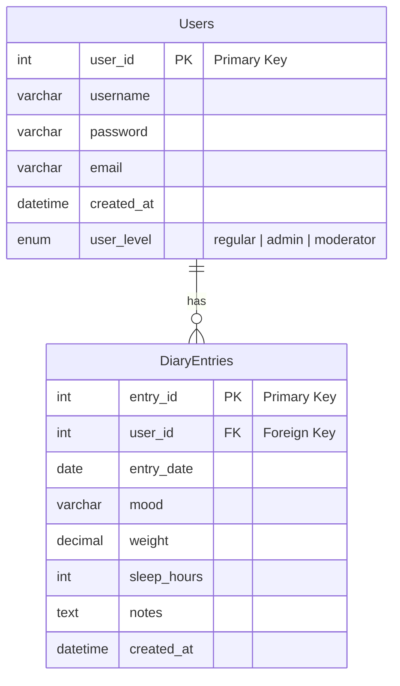

# Relational Databases

(recap from 1st year)

## TOC

1. Relational Database Concepts
1. SQL basics
   - Creating a Database
   - Querying data
   - Updating data
   - Deleting data
   - SQL scripts
1. Assignment

## Relational Database Concepts

### Database

- Database is a collection of related data
- Long term storage: data is persisted and can be retrieved later
- Typically, a database contains also metadata
- Descriptions of data types, structures, and constraints of the actual data
- Compare to plain files
- **Database Management System** (DBMS) is collection of applications that can be used to create and maintain databases
  - MySQL, SQLite, Microsoft SQL Server, etc.
- Note: several applications or users can use the same database

### Database model

- A **Database model** defines
  - Structure of a database
  - How data is stored, organized, and manipulated
- Different database models
  - Relational model
  - Network model
  - Object model
  - Document model
- **Relational model** is the most widely used database model
  - Implemented by several DBMSes (e.g. MySQL, Postgre, Oracle, etc.) since 1970s
  - Relational databases are typically operated through **Structured Query Language (SQL)**

### Relational database model

- Data is stored in named tables
- A table is a collection of records (rows) that have similar properties (columns)
- Each table has a dedicated column (primary key, PK) that identifies its records unambiguously
- Each table may have a column (foreign key, FK) that is used to reference primary key in another table
- Note:
  - Columns have no specific order
  - Records have no specific order
- Designing a database comprises of defining and identifying tables, columns, and keys we need
- After a database has been designed and implemented, the actual data (records) may be inserted (or imported) into it
- An operational database may be queried for information (search and
combine information stored in records)

#### DiaryEntries table example data

| entry_id | user_id | entry_date | mood     | weight | sleep_hours | notes                          | created_at          |
|----------|---------|------------|----------|--------|-------------|--------------------------------|---------------------|
| 1        | 1       | 2024-01-10 | Happy    | 70.5   | 8           | Had a great day, felt energetic| 2024-01-10 20:00:00 |
| 2        | 1       | 2024-01-11 | Tired    | 70.2   | 6           | Long day at work, need rest    | 2024-01-11 20:00:00 |
| 3        | 2       | 2024-01-10 | Stressed | 65.0   | 7           | Busy day, a bit stressed out   | 2024-01-10 21:00:00 |

#### Users table example data

| user_id | username   | password     | email              | created_at          | user_level |
|---------|------------|--------------|--------------------|---------------------|------------|
| 1       | johndoe    | temp-pw-1    | johndoe@example.com| 2024-01-01 09:00:00 | regular    |
| 2       | janedoe    | temp-pw-2    | janedoe@example.com| 2024-01-02 10:00:00 | admin      |
| 3       | mike_smith | temp-pw-3    | mike@example.com   | 2024-01-03 11:00:00 | regular    |

**What is the relation between these two tables?**

### Primary key (PK)

- A column (or group of colums) that uniquely identifies records (rows) in the table
- Must be unique value, two records cannot have the same value for the primary key
- Each record must have a value for primary key
- Every table must have a primary key (defined by database designer)
- Sometimes it is difficult to identify proper, unique primary identifier among columns
  - in these cases, a surrogate key (e.g "id") may be added
  - surrogate key is typically a sequential number (e.g., an auto-incremented number in SQL databases) that is assigned to each record as it is created

### Foreign key (FK)

- Foreign key references primary key in another table
  - creates a relation between tables
  - Reference may be missing (NULL value)



### Integrity constraints

- Integrity constraints are **rules that database records must satisfy**
  - Otherwise database might end up in inconsistent or unusable state
  - Constraints are (usually) enforced by DBMS at all times
- **Primary key constrain**: Primary key values must be unique
- **Referential Integrity Constraint**: Referenced primary key value must exist (enforcement varies between DBMSes)
- **Value constraint**: Each column has a data type defined; values must be within the range

### Database server and client

- **Database server** is a computer that runs database system
  - You need an account to use the system
- **Database client** is a program that connects to server and requests database services
  - Client may have just a command line or graphical user interface
  - In this course the client will be a back-end web application
- Typically client and server reside on different machines, but may also run in the same machine
  - E.g. the development environment setup on your laptop

### Terminology in Finnish

- Database: tietokanta
- Table: taulu
- Record: tietue
- Column (field): sarake (kenttä)
- Primary Key: perusavain/pääavain
- Foreign Key: viiteavain
- Integrity Constraint: eheysrajoite
- DBMS: tietokannanhallintajärjestelmä
- Key Constraint: avainrajoite
- Referential Integrity Constraint: viite-eheysrajoite
- Value Constraint: arvoaluerajoite

## Structured Query Language, SQL

- Standardized language for operating relational databases
  - Supported by many DBMSes – MariaDB, MySQL, SQLite, PostgreSQL, Oracle, etc.
  - Minor differences between implementations
- Operations for:
  - Database creation
  - Data insertion, deletion, and updates
  - Querying database
- Declarative query language: user describes what data he wants to find, and DBMS figures out a way to get it

### Creating a database

```sql
-- Remove existing database completely (needs a root access to DBMS)
DROP DATABASE IF EXISTS database_name;
-- Create a new database (needs a root access to DBMS)
CREATE DATABASE database_name;
-- Connect to the database
USE database_name;

-- Example
DROP DATABASE IF EXISTS HealthDiary;
CREATE DATABASE HealthDiary;
USE HealthDiary;
```

Notes:

- SQL statements end with semicolon and may be split into several lines
- SQL statements can be a written in a script (plain text) file and run from there
- SQL is not case sensitive, but it is a good practice to write SQL keywords in uppercase
- Use `show databases` command to show available databases
- `DROP DATABASE database_name;` deletes the database and all its tables and data completely (No comfirmation is asked!)

### Creating tables

```sql
CREATE TABLE table_name (
  column_name1 data_type [NOT NULL] [UNIQUE] [PRIMARY KEY],
  column_name2 data_type [NOT NULL] [UNIQUE],
  column_name3 data_type [NOT NULL] [UNIQUE],
  ...
  column_nameN data_type [NOT NULL] [UNIQUE],
  PRIMARY KEY (column_name1)
);
```

- `create table` statement creates a new database table (just the table structure, not any records)
- The statement defines:
  - Table name
  - Column names and data types
  - Primay key column(s)
  - Possibly foreign keys as well (enforcement of foreign key constraint depends on the database engine and settings)
  - Other constraints, e.g. NOT NULL if column value cannot be NULL, UNIQUE if column values must be unique, AUTO_INCREMENT if column value is automatically incremented when new record is inserted
- Tips:
  - `show tables` lists all existing tables
  - `describe table_name` describes details of given table
  - `drop table_name` deletes given table completely
  - `alter table` may be used to modify existing table
  - Creating tables is often a bit tedious, so it’s best to store the statements in a script file

Example:

```sql
-- Create a table for users
CREATE TABLE Users (
    user_id INT AUTO_INCREMENT PRIMARY KEY,
    username VARCHAR(50) NOT NULL UNIQUE,
    password VARCHAR(255) NOT NULL,
    email VARCHAR(100) NOT NULL UNIQUE,
    created_at DATETIME DEFAULT CURRENT_TIMESTAMP
);

-- Create a table for diary entries
CREATE TABLE DiaryEntries (
    entry_id INT AUTO_INCREMENT PRIMARY KEY,
    user_id INT,
    entry_date DATE NOT NULL,
    mood VARCHAR(50),
    weight DECIMAL(5,2),
    sleep_hours INT,
    notes TEXT,
    created_at DATETIME DEFAULT CURRENT_TIMESTAMP,
    FOREIGN KEY (user_id) REFERENCES Users(user_id)
);

-- ALTER example, adding a new column to existing table
ALTER TABLE Users ADD COLUMN user_level VARCHAR(10) DEFAULT 'regular';
```

- Column data types define what kind of data is stored in the column
- There are plenty of different data types, see e.g. <https://www.w3schools.com/sql/sql_datatypes.asp>
- The most data types are:
  - INT - Integer values
  - DOUBLE - Floating point numbers
  - VARCHAR - Strings
  - DATE - Dates
  - TIMESTAMP/DATETIME - Date and time
- Foreign key specifications are not mandatory, but necessary if one wants to enforce foreign key constraint (Referenced tables should be created first)

### Inserting data

```sql
INSERT INTO table_name (column1, column2, column3, ...)
  VALUES (value1, value2, value3, ...);

-- or

INSERT INTO table_name
  VALUES (value1, value2, value3, ...);
```

- `insert into` statement inserts records into existing table
  - First version specifies values to given columns, the latter version requires
values for all the columns
- You can list all existing records with `select * from table_name;`

Examples:

```sql
-- Inserting a single record, without specifying column names
INSERT INTO Users VALUES (1, 'johndoe', 'temp-pw-1', 'johndoe@example.com', null, 'regular');

-- Iserting multiple user rows at once
INSERT INTO Users (username, password, email, created_at, user_level) VALUES
  ('janedoe', 'temp-pw-2', 'janedoe@example.com', '2024-01-02 10:00:00', 'admin'),
  ('mike_smith', 'temp-pw-3', 'mike@example.com', '2024-01-03 11:00:00', 'moderator');

-- Example when FK constraint fails (if user_id 15 does not exist)
INSERT INTO DiaryEntries (user_id, entry_date, mood, weight, sleep_hours, notes, created_at) VALUES
  (15, '2024-01-10', 'Happy', 70.5, 8, 'Had a great day, felt energetic', '2024-01-10 20:00:00');

-- Inserting multiple diary entries
INSERT INTO DiaryEntries (user_id, entry_date, mood, weight, sleep_hours, notes, created_at) VALUES
  (1, '2024-01-10', 'Happy', 70.5, 8, 'Had a great day, felt energetic', '2024-01-10 20:00:00'),
  (1, '2024-01-11', 'Tired', 70.2, 6, 'Long day at work, need rest', '2024-01-11 20:00:00'),
  (2, '2024-01-10', 'Stressed', 65.0, 7, 'Busy day, a bit stressed out', '2024-01-10 21:00:00');
```

Note: referenced records (`user_id` in this case) in other tables must exist (foreign key constraint)
There are other ways and tools for mass importing data, e.g. from CSV files, other databases, etc.

### Querying data

- SQL queries retrieve meaningful data from a database
- SQL is a declarative language
  - Tell what kind of data you’re interested in
  - DBMS figures out a way to get the data for you

Select statement:

```sql
SELECT [ALL | DISTINCT] column1[,column2]
  FROM table1[,table2]
  [WHERE conditions]
  [GROUP BY column-list]
  [HAVING conditions]
  [ORDER BY column-list [ASC | DESC] ]
  [LIMIT number];
```

- `select` - selects desired column(s) `*` means every column
- `from` which table(s) the data is retrieved from
- `where` - Conditions that records must satisfy (optional)
- `group by` - Group records by given column(s) (optional)
- `having` - Conditions that groups must satisfy (optional)
- `order by` - Order records by given column(s) in ASCending or DESCending order (optional)
- `limit` - Limit the number of records (optional)

```sql
-- Select all columns from the DiaryEntries table:
SELECT * FROM DiaryEntries;

-- Select all diary entries for a specific user:
SELECT * FROM DiaryEntries WHERE user_id = 2;

-- Select usernames and emails from the Users table:
SELECT username, email FROM Users;

-- Select the 2 newest diary entries:
SELECT * FROM DiaryEntries ORDER BY created_at DESC LIMIT 2;
```

#### Operators and functions

- Arithmetic operators: + - * / %
- Equal to: `=` example: `firstname = 'Eric’`
- Not equal to: `<>` example: `firstname <> 'Mike’`
- Greater than: `>` example: `dateofbirth > '1993-01-31’`
- Less than: `<` example: `salary < 2000`
- Greater (Lesser) than or equal: `>=` (or `<=`) example: `salary >= 2000`
- Match a character pattern: `LIKE` example: `firstname LIKE 'Mi%'`
- Between an inclusive range: `BETWEEN` example: `salary BETWEEN 1000 AND 2000`
- Equal to one of multiple possible values: `IN` example: `deptcode IN (101, 103, 209)`
- Compare to null (missing data): `IS` or `IS NOT` example: `address IS NULL`
- Absolute value: `ABS(x)`
- Sign (-1, 0, -1): `SIGN(x)`
- Modulo: `MOD(x)`
- Raise x to power y: `POWER(x, y)`
- Square root: `SQRT(x)`
- Largest integer <= x: `FLOOR(x)`
- Smallest integer >= x: `CEIL(x)`
- Round to nearest integer: `ROUND(x)`
- Round x to d decimal places: `ROUND(x, d)`

Examples:

```sql
-- Find users with a username starting with 'J':
SELECT * FROM Users WHERE username LIKE 'J%';

-- Select users created after a certain date:
SELECT * FROM Users WHERE created_at > '2024-01-01';
```

#### Querying several tables

- Queries often need to collect data from two (or more) tables
- If one specifies two tables in `from`-clause, the result will include
every combination of records from both tables called "cartesian product". For example, if the tables have 1000 records both, the result will have 1000 x 1000 = 1M rows
- Typically, one needs to specify which records from both sides are to be combined (very often through foreign keys) by using `WHERE` condition or `JOIN` operation

Examples:

```sql
-- "cartesian product" of two tables:
SELECT * FROM Users, DiaryEntries;

-- Select all columns from both tables where user_id matches:
SELECT * FROM Users, DiaryEntries WHERE Users.user_id = DiaryEntries.user_id;

-- Select all diary entries along with the username of the owner using a (inner) join:
SELECT DiaryEntries.*, Users.username 
  FROM DiaryEntries 
  JOIN Users ON DiaryEntries.user_id = Users.user_id;

-- Select all diary entries along with the username where the mood is 'Happy':
SELECT DiaryEntries.*, Users.username
  FROM DiaryEntries
  JOIN Users ON DiaryEntries.user_id = Users.user_id
  WHERE DiaryEntries.mood = 'Happy';

-- Select all diary entries and all users whether they have diary entries or not. 
SELECT 
  Users.user_id, 
  Users.username, 
  DiaryEntries.entry_id, 
  DiaryEntries.entry_date, 
  DiaryEntries.mood, 
  DiaryEntries.notes
FROM 
  Users
LEFT OUTER JOIN DiaryEntries 
  ON Users.user_id = DiaryEntries.user_id;
```

### Updating data

Database state is changed by following operations:

- Inserting records
- Updating records
- Deleting records

- Database content updates are very common
- Database structure (tables, keys, types, etc.) should change very seldom if at all (after the design time)
  - Changes in the structure would often break applications that use the database

#### Update statement

```sql
UPDATE table_name
  SET column1 = value1, column2 = value2, ...
  WHERE condition;
```

`UPDATE` changes column values for record(s)

- If `WHERE` is missing, all records in the table are changed, Be careful!
- It is possible to specify modified records in a subquery

Examples:

```sql
-- Change user_level of user with id 1 to 'admin'
UPDATE Users SET user_level = 'admin' WHERE user_id = 1;

-- Change mood of entry with id 1 to 'Outstanding'
UPDATE DiaryEntries SET mood = 'Outstanding' WHERE entry_id = 1;
```

#### Delete statement

```sql
DELETE FROM table_name
  WHERE condition;
```

`DELETE` removes records from a database

- If WHERE is missing, all records are removed (table is emptied). Be careful, no questions asked!

Examples:

```sql
DELETE FROM DiaryEntries WHERE entry_id = 2;
```

### SQL scripts

- Separate text files that contain SQL statements
  - Can be executed as necessary on the sql command line: `source path-to-script.sql`
  - using the mysql command line tool: `mysql -u username -p database_name < path-to-script.sql`
  - or in a graphical DBMS tool (Many graphical DBMS tools (e.g. MySQL Workbench) actually generate SQL scripts for its operations)
- Recommended way for database creation and data import
- Databases and their contents can be easily exported and imported as SQL scripts
  - export using a command line tool: `mysqldump -u username -p database_name > path-to-script.sql`
  - Used for backups, copying and moving databases, etc.

---

## Week assignment 3

Think about requirements of a health diary app. What kind of data is needed?

1. Design couple tables more for the app (in addition to the ones we already have in examples)
1. Draw a diagram of the database structure (including relations between tables)
1. Define the data types for the columns
1. Define primary keys and foreign keys
1. Implement SQL statements for creating the tables
1. Insert multiple records of mock data into the tables
1. Think about use cases for the data from the application point of view and provide examples how to update, delete and query the data in a meaningful way
1. Create a script including all your SQL statements (create tables, insert data, queries, updates, etc.)

**Returning:** Check assignment in OMA.
