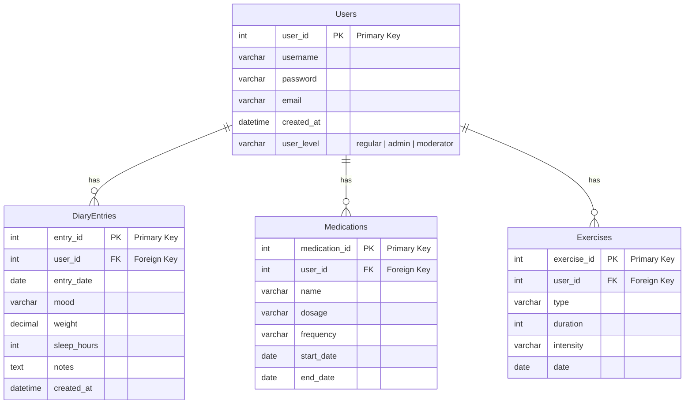

# Database design and more SQL

## Example database for Simple Health Diary REST API

For a basic health diary, you might want to track information like user details, diary entries (including date, health metrics, notes), and perhaps additional data like medication or exercise logs.

Entity-relationship diagram



## Example database setup and some sample data

Review and import [this script file](assets/health-diary-db.sql).

## Advanced SQL queries

?? TODO: modify for health diary

### Grouping and aggregation

Query result may have several identical rows. To get unique rows only, use `DISTINCT`:

```sql
-- select unique user levels
SELECT DISTINCT user_level FROM Users;
```

Use `GROUP BY` clause to group resulting groups by column(s). With one column works similarly to `DISTINCT` but grouping can be done by many columns:

```sql
-- one column
SELECT user_level FROM Users GROUP BY user_level;
-- two columns
SELECT type, intensity FROM Exercises
  GROUP BY type, intensity;
```

Note if grouping is used, you can only SELECT columns that are

- Part of GROUP BY
- Part of aggregate function

For example, the query below is ambigious (which intensity to select for each type?):

```sql
SELECT type, intensity FROM Exercises
  GROUP BY type;
```

Groups can be filtered by `HAVING` clause:

```sql
-- select exercise types having more than one item
SELECT type FROM Exercises
  GROUP BY type
  HAVING COUNT(type) > 1;

-- select exercise types and count of them having more than one item
SELECT type, COUNT(type) AS count
  FROM Exercises
  GROUP BY type
  HAVING count > 1;
```

Aggregate functions can be applied to groups defined by `GROUP BY`

- If no grouping in specified, the aggregate function applies to the query result as a whole
- For example, aggregate function `COUNT(*)` returns the record count within each group
- Some aggregate functions
  - `AVG`: Average
  - `COUNT`: Count
  - `MIN`: Minimum value
  - `MAX`: Maximum value
  - `STDDEV`: Standard deviation
  - `SUM`: Sum

```sql
-- select total amount of sleep for a user with id 4
SELECT SUM(sleep_hours) FROM DiaryEntries WHERE user_id = 4;

-- select count of diary entries for each user
SELECT user_id, COUNT(*) FROM DiaryEntries GROUP BY user_id;

-- select longest, shortest and average sleep duration for each user
SELECT username, MIN(sleep_hours), MAX(sleep_hours), AVG(sleep_hours)
  FROM DiaryEntries JOIN Users ON DiaryEntries.user_id = Users.user_id
  GROUP BY username;
```

### Subqueries

`SELECT`, `UPDATE` and `DELETE` operations may contain other SELECT queries as a subqueries

- can be nested, the innermost query is executed first
- Membership in inner query’s result set can be tested with `IN` or `NOT IN` operator

```sql
-- select all users who have medication using subquery
SELECT * FROM Users WHERE user_id IN (
  SELECT user_id FROM Medications
);

-- select all users who have no diary entries
SELECT * FROM Users WHERE user_id NOT IN (
  SELECT user_id FROM DiaryEntries
);

-- change all admins to regular users
UPDATE Users SET user_level = 'regular' WHERE user_id IN (
  SELECT user_id FROM Users WHERE user_level = 'admin'
);

```

## Links & extra material

- [TutorialsTeacher: Learn SQL (Standard Query Language) for Databases](https://www.tutorialsteacher.com/sql)
- [W3Schools: SQL Tutorial](https://www.w3schools.com/sql/)

**Next**: [Express MVC, Routing, Middlewares and Database connection](07-express-mvc-db.md)
