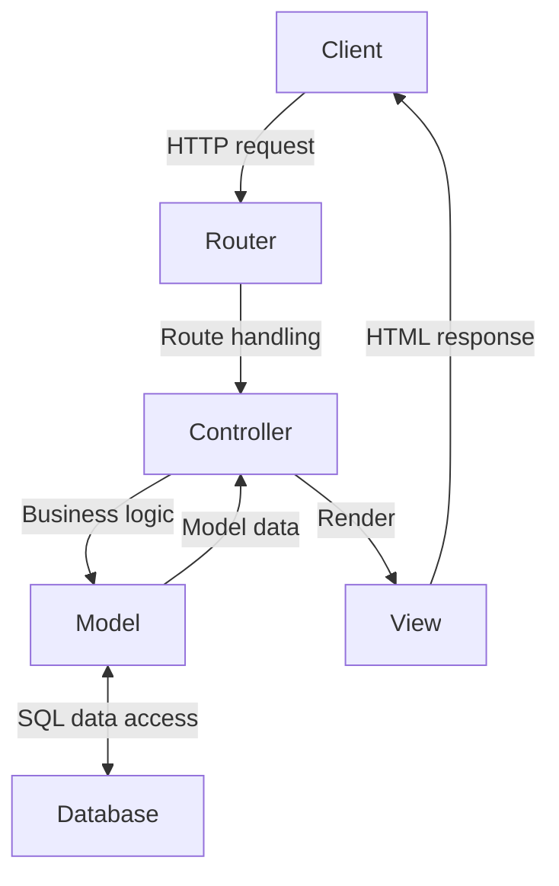
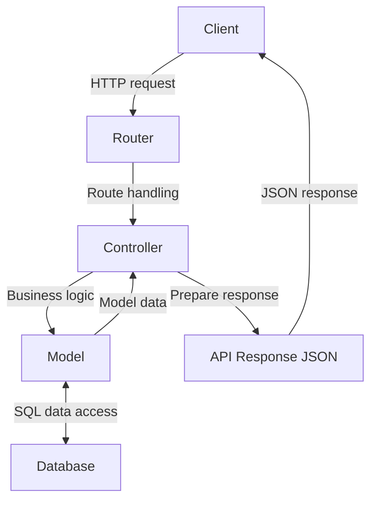

# Express MVC, Routing, Middlewares and Database connection

## Model-View-Controller (MVC)

MVC is a [design pattern](https://en.wikipedia.org/wiki/Software_design_pattern) that divides the application into three interconnected components:

- **Model**: Represents the application's data and the business rules that govern access to and updates of this data. In many cases, the model component is responsible for retrieving data, processing it, and then storing it. It is independent of the user interface (UI).
- **View**: Represents the UI of the application. It displays the data that the model contains to the user and sends user commands (e.g., button clicks) to the controller. The view is passive, meaning it waits for the model or controller to give it data to display.
- **Controller**: Acts as an intermediary between the Model and the View. It listens to events triggered by the View and executes the appropriate response, often resulting in a change in the Model's state. Similarly, when the Model changes (e.g., data is updated), the Controller is responsible for refreshing the View.

Benefits of MVC:

- Separation of Concerns: By separating the application into these components, MVC aids in the organization of code, making it more modular and scalable. Each component has a distinct responsibility.
- Maintainability: With clear separations, developers can work on one aspect of an application (like the UI) without having to touch the data logic code. This separation allows teams to work on different parts of an application simultaneously.
- Flexibility: The View and the Model can evolve separately. Multiple Views can be created from one Model, which is especially useful when you have web, mobile, and other UIs for the same data.
- Reusability: Business logic in the Model can often be reused across different parts of an application or even different projects.

Many popular web development frameworks like Django (Python), Ruby on Rails (Ruby), ASP.NET MVC (C#), and **Express** with Pug or EJS implement the MVC pattern or variations of it. The MVC pattern has been adapted in slightly different ways by various frameworks, but the core principle remains:

1. When a user sends a n HTTP request, the request first reaches the Controller.
2. The Controller processes the request, interacts with the Model (which might involve querying a database), and then decides which View should be used to display the resulting data.
3. The View takes the data, renders it, and sends the resulting webpage back to the user (server-side rendering, SSR).



When adapted to REST API the view is typically represented by the format of the API response (usually JSON), rather than a traditional user interface which is this case rendered on the client-side (CSR).



## Project structure

Type-based folder structure (typical for Express applications):

```dir
src/
├── controllers/
│   ├── entryController.js
│   └── userController.js
├── models/
│   ├── entryModel.js
│   └── userModel.js
├── routes/
│   ├── entryRoutes.js
│   └── userRoutes.js
└── index.js
```

Feature-based folder structure:

```dir
src/
├── entry/
│   ├── controller.js
│   ├── model.js
│   └── routes.js
├── user/
│   ├── controller.js
│   ├── model.js
│   └── routes.js
└── index.js
```

Both of the folder structures has its benefits. The type-based structure is simple and straightforward, making it easy to navigate for small projects. The feature-based structure, on the other hand, scales better for larger applications by grouping all related files by feature, making the codebase more modular and maintainable.

## Routing in Express

[express.Router](https://expressjs.com/en/guide/routing.html#express-router) is a middleware and more advanced routing system that allows you to modularize your routes into separate files.

### Example

_src/index.js:_

```js
...
import entryRouter from './routes/entry-router.js';

...

// bind base url for all entry routes to entryRouter
app.use('/api/entries', entryRouter);

...

```

_src/routes/entry-router.js:_

```js
import express from 'express';
import {
  getEntries,
  getEntryById,
  postEntry,
  putEntry,
  deleteEntry,
} from '../controllers/entry-controller.js';

const entryRouter = express.Router();

entryRouter.route('/').get(getEntries).post(postEntry);

entryRouter.route('/:id')
  .get(getEntryById)
  .put(putEntry)
  .delete(deleteEntry);

export default entryRouter;
```

_src/controllers/entry-controller.js:_

```js
import {addEntry, findEntryById, listAllEntries} from "../models/entry-model.js";

const getEntries = (req, res) => {
  res.json(listAllEntries());
};

const getEntryById = (req, res) => {
  const entry = findEntryById(req.params.id);
  if (entry) {
    res.json(entry);
  } else {
    res.sendStatus(404);
  }
};

const postEntry = (req, res) => {
  const {user_id, entry_date, mood, weight, sleep_hours, notes} = req.body;
  // validate input, ensure required fields are present
  if (entry_date && (weight || mood || sleep_hours || notes) && user_id) {
    addEntry(req.body);
    res.status(201);
    res.json({message: 'New entry added.'})
  } else {
    res.sendStatus(400);  
  }
};

const putEntry = (req, res) => {
  // not implemented yet with the mock data
  res.sendStatus(200);
};

const deleteEntry = (req, res) => {
  // not implemented yet with the mock data
  res.sendStatus(200);
};

export {getEntries, getEntryById, postEntry, putEntry, deleteEntry};
```

_src/models/entry-model.js:_

```js
// temporal mock data for testing, should be replaced with real data from DB
const diaryEntries = [
  {
    "entry_id": 5,
    "user_id": 5,
    "entry_date": "2024-01-14",
    "mood": "Relaxed",
    "weight": 75.0,
    "sleep_hours": 8,
    "notes": "Spent the day reading",
    "created_at": "2024-01-14T19:00:00"
  },
  {
    "entry_id": 4,
    "user_id": 4,
    "entry_date": "2024-01-13",
    "mood": "Energetic",
    "weight": 55.0,
    "sleep_hours": 9,
    "notes": "Went for a morning run",
    "created_at": "2024-01-13T18:00:00"
  },
  {
    "entry_id": 3,
    "user_id": 3,
    "entry_date": "2024-01-12",
    "mood": "Tired",
    "weight": 68.0,
    "sleep_hours": 6,
    "notes": "Work was demanding",
    "created_at": "2024-01-12T22:00:00"
  },
  {
    "entry_id": 2,
    "user_id": 2,
    "entry_date": "2024-01-11",
    "mood": "Satisfied",
    "weight": 65.0,
    "sleep_hours": 7,
    "notes": "Met with friends, had a good time",
    "created_at": "2024-01-11T21:00:00"
  },
  {
    "entry_id": 1,
    "user_id": 1,
    "entry_date": "2024-01-10",
    "mood": "Happy",
    "weight": 70.5,
    "sleep_hours": 8,
    "notes": "Had a great workout session",
    "created_at": "2024-01-10T20:00:00"
  }
];

const listAllEntries = () => {
  return diaryEntries;
};

const findEntryById = (id) => {
  return diaryEntries.find((item) => item.entry_id == id);
};

const addEntry = (entry) => {
  const {user_id, entry_date, mood, weight, sleep_hours, notes} = entry;
  const newId = diaryEntries[0].entry_id + 1;
  diaryEntries.unshift({entry_id: newId, entry_date, mood, weight, sleep_hours, notes, user_id});
};

export {listAllEntries, findEntryById, addEntry};
```

## Middlewares

Middleware functions are functions that have access to the request object (`req`), the response object (`res`), and the next middleware function in the application's request-response cycle. The next middleware function is commonly denoted by a variable named `next`.

Study: [using middleware](https://expressjs.com/en/guide/using-middleware.html) and [writing middleware](https://expressjs.com/en/guide/writing-middleware.html) in Express.

### Cross-Origin Resource Sharing (CORS)

If running the front-end and back-end on different servers, you need to take care of [CORS](https://developer.mozilla.org/en-US/docs/Web/HTTP/CORS) issues. One option is to use the [cors](https://github.com/expressjs/cors#readme) middleware [in Express](https://expressjs.com/en/resources/middleware/cors.html) app.

## Database connection in Express

1. Import the [example database](assets/health-diary-db.sql).
1. Create a database user and grant privileges to the database:

    ```sql
    CREATE USER 'myusername'@'localhost' IDENTIFIED BY 'mypassword';
    GRANT ALL PRIVILEGES ON `databasename`.* TO 'myusername'@'localhost';
    FLUSH PRIVILEGES;
    ```

1. Install [dotenv](https://github.com/motdotla/dotenv#readme) to load environment variables from a `.env` file into `process.env`.
   - `.env` file is used to store sensitive data like database credentials and should not be committed to version control (remember to add to `.gitignore`).
   - Add `.env` file to the project root folder and add the following content to it:

    ```env
    DB_HOST=localhost
    DB_USER=myusername
    DB_PASSWORD=mypassword
    DB_NAME=databasename
    ```

1. Study & install [mysql2](https://github.com/sidorares/node-mysql2#readme) package
1. Create a new file `src/utils/database.js` and add the following code to it:

    ```js
    import mysql from 'mysql2';
    import 'dotenv/config';

    const pool = mysql.createPool({
      host: process.env.DB_HOST,
      user: process.env.DB_USER,
      password: process.env.DB_PASSWORD,
      database: process.env.DB_NAME,
      waitForConnections: true,
      connectionLimit: 10,
      queueLimit: 0,
    });
    const promisePool = pool.promise();
    export default promisePool;
    ```

### MySQL2 examples

JavaScript variables in SQL queries should be handled using [prepared statements](https://sidorares.github.io/node-mysql2/docs#using-prepared-statements) to prevent SQL injection attacks (use `execute()` method for queries instead of `query()`).

_entry-model.js:_

```js
// Note: db functions are async and must be called with await from the controller
// How to handle errors in controller?
import promisePool from '../utils/database.js';

const listAllEntries = async () => {
  try {
    const [rows] = await promisePool.query('SELECT * FROM DiaryEntries');
    console.log('rows', rows);
    return rows;
  } catch (e) {
    console.error('error', e.message);
    return {error: e.message};
  }
};

const findEntryById = async (id) => {
  try {
    const [rows] = await promisePool.execute('SELECT * FROM DiaryEntries WHERE entry_id = ?', [id]);
    console.log('rows', rows);
    return rows[0];
  } catch (e) {
    console.error('error', e.message);
    return {error: e.message};
  }
};

const addEntry = async (entry) => {
  const {user_id, entry_date, mood, weight, sleep_hours, notes} = entry;
  const sql = `INSERT INTO DiaryEntries (user_id, entry_date, mood, weight, sleep_hours, notes)
               VALUES (?, ?, ?, ?, ?, ?)`;
  const params = [user_id, entry_date, mood, weight, sleep_hours, notes];
  try {
    const rows = await promisePool.execute(sql, params);
    console.log('rows', rows);
    return {entry_id: rows[0].insertId};
  } catch (e) {
    console.error('error', e.message);
    return {error: e.message};
  }
};

export {listAllEntries, findEntryById, addEntry};
```

_entry-controller.js:_

```js
import {listAllEntries, findEntryById, addEntry} from "../models/entry-model.js";

const getEntries = async (req, res) => {
  const result = await listAllEntries();
  if (!result.error) {
    res.json(result);
  } else {
    res.status(500);
    res.json(result);
  }
};

const getEntryById = async (req, res) => {
  const entry = await findEntryById(req.params.id);
  if (entry) {
    res.json(entry);
  } else {
    res.sendStatus(404);
  }
};

const postEntry = async (req, res) => {
  const {user_id, entry_date, mood, weight, sleep_hours, notes} = req.body;
  if (entry_date && (weight || mood || sleep_hours || notes) && user_id) {
    const result = await addEntry(req.body);
    if (result.entry_id) {
      res.status(201);
      res.json({message: 'New entry added.', ...result});
    } else {
      res.status(500);
      res.json(result);
    }
  } else {
    res.sendStatus(400);
  }
};

const putEntry = (req, res) => {
  // placeholder for future implementation
  res.sendStatus(200);
};

const deleteEntry = (req, res) => {
  // placeholder for future implementation
  res.sendStatus(200);
};

export {getEntries, getEntryById, postEntry, putEntry, deleteEntry};
```

### SQL/data model abstraction

[Sequelize](https://sequelize.org/) is an Object-Relational Mapping (ORM) library for Node.js. It provides a high-level abstraction over SQL databases, allowing developers to interact with the database using JavaScript objects and methods, rather than writing raw SQL queries. It would make it easier to develop complex applications without much SQL knowledge.

[mysql2](https://github.com/sidorares/node-mysql2#readme), which we use in the assignments, is a MySQL client library that requires writing SQL queries manually, offering more control and efficiency at the expense of convenience and higher code complexity for database interactions. It's often preferred for applications where direct SQL control is necessary or for simpler database needs.

---

## Week Assignment 4 - Express MVC and database

1. Continue your existing Express app and create a branch `express-db`
1. Implement MVC model (file or feature based project structure, your choice)
   - You can use the teacher's example code as a starting point (see Oma).
   - Convert your existing API resources (`/api/entries` and `/api/users`) to use the MVC model
   - Use react.Router to modularize your routes for separate endpoints
   - Connect to the database (mysql2) and use appropriate SQL statements in the data models
   - Use the previous week's example database instead of mock data
   - Implement all of the following endpoints:
     - `GET /api/entries` - list all diary entries
     - `GET /api/entries/:id` - get diary entry by id
     - `PUT /api/entries/:id` - update a diary entry (optional)
     - `DELETE /api/entries/:id` - delete entry (optional)
     - `GET /api/users` - list all users
     - `GET /api/users/:id` - get user by id
     - `POST /api/users` - add a new user
     - `PUT /api/users/:id` - update user (optional)
     - `DELETE /api/users/:id` - delete user (optional)
1. Extra: Design and implement endpoints for _medications_, _exercises_ or your own custom resource
   - Think about what the user of application would need to do with the data
   - Describe your implementations and the use cases for it
     - What features/functions you implemented and why?
     - How they work?

**Returning:** See assignment in Oma.

---

<!-- add mermaid support for gh pages -->
<script type="module">
    Array.from(document.getElementsByClassName("language-mermaid")).forEach(element => {
      element.classList.add("mermaid");
    });
    import mermaid from 'https://cdn.jsdelivr.net/npm/mermaid@11/dist/mermaid.esm.min.mjs';
    mermaid.initialize({ startOnLoad: true });
</script>
