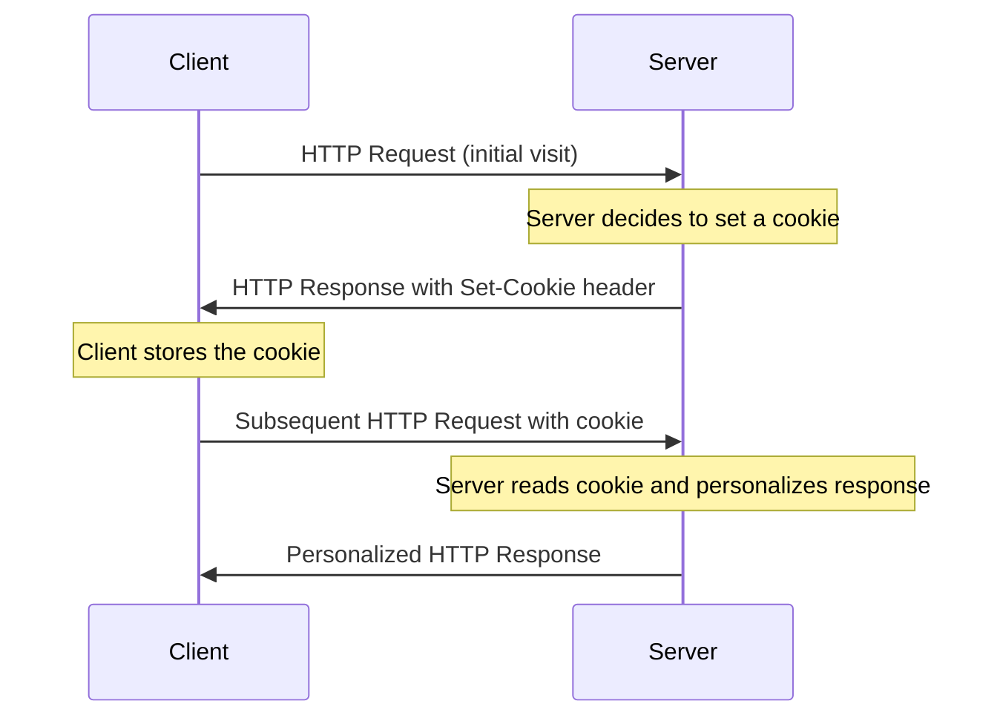
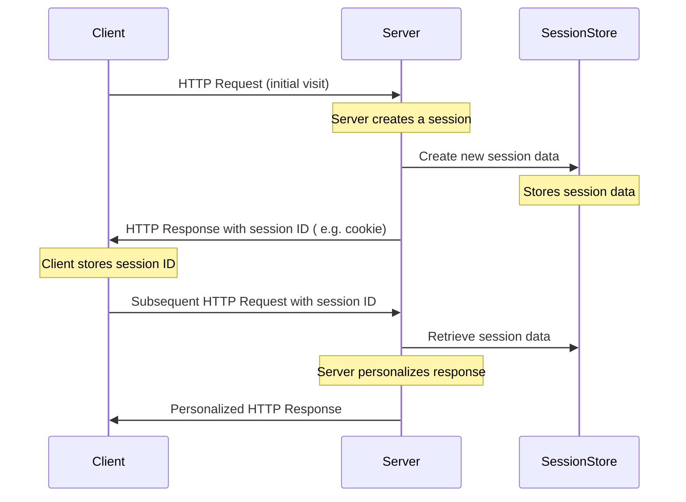
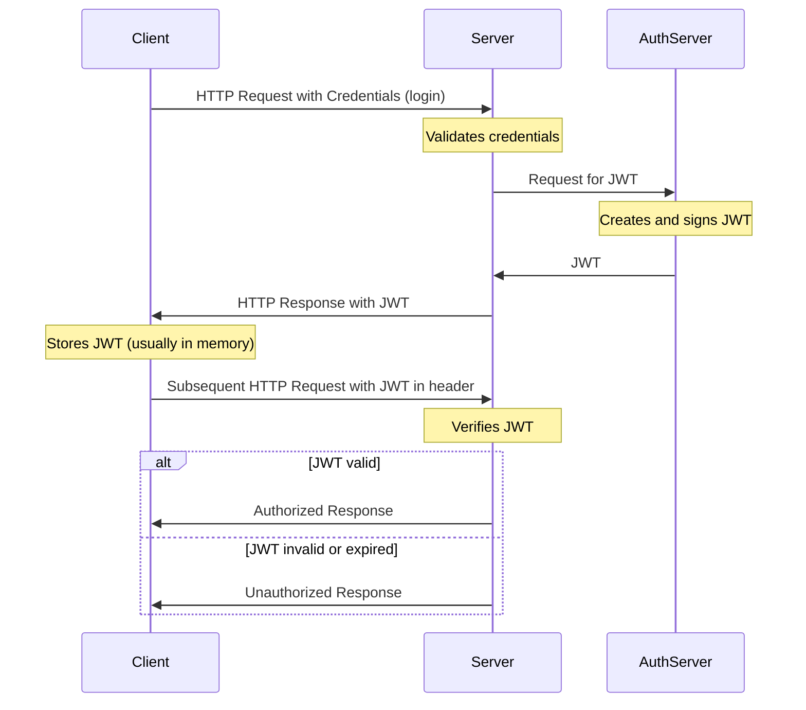

# Application State and User Authentication

## Maintaining State in Web Applications

In any realistic interactive Web application you will come across the need of retaining information between individual pages. This is referred to as "maintaining state" or as the "persistence of data". HTTP protocol does not support this, it is a _stateless_ protocol - every page request starts in a blank state with no knowledge of data that was available on the previous page. Since HTTP is stateless by nature, web applications need to implement their own methods for maintaining state. There is several common strategies to implement this on the server-side.

Choosing the right method for maintaining state depends on the specific requirements of your application, such as the type of data being stored, security considerations, scalability, and whether the state is user-specific or shared across users. It's common to use a combination of these methods to address different aspects of application state.

### Cookies

- Small pieces of data stored on the client's browser. Cookies are sent back to the server with every HTTP request.
- Cookies store variables as name and value pairs, plus additional information such as expiration time and the name of web site where the cookie came form.
- By default web site can modify only it's own cookies
Use Cases: Remembering user preferences, authentication tokens, tracking sessions.
Limitations: Size is limited (typically 4KB), and they can pose security and privacy concerns if not handled correctly.



### Server-Side Sessions

- Server stores session data, and a session identifier is typically sent to the client (often in a cookie or in HTTP headers/URL query params).
- Can be used for user authentication and storing for user-specific data while the user navigates the application.
- Requires server resources and proper management to ensure scalability and security.



### URL Parameters and Query Strings

- Passing state information in URLs as query strings. For example: `https://example.com/app?user=johndoe&theme=dark`.
- Maintaining state across different pages without needing server or client-side storage, such as filtering or search parameters.
- Visible to users, can be modified, and have length limitations.

### Hidden Form Fields

- Storing state information in hidden fields within HTML forms. For example:

  ```html
  <form action="https://example.com/app">
    <input type="hidden" name="user" value="johndoe">
    <input type="hidden" name="theme" value="dark">
    <input type="submit" value="Submit">
  </form>
  ```

- Maintaining state across form submissions.
- Only applicable for state that needs to persist across form submissions.

### Token-Based Authentication

- Tokens (e.g. [JSON Web Tokens (JWT)](https://jwt.io/)) are used to maintain user state and authentication information.
  - usually used for authentication and authorization purposes, especially in Single Page Applications (SPAs) and API services.
- Consider security in storing and transporting tokens, typically requires HTTPS.

The process of authentication using JWT and subsequent requests with the token in typical client-server interaction:



### Client-Side State Management

- Web Storage API
  - Local Storage: Stores data with no expiration date, and it's accessible across browser sessions.
  - Session Storage: Similar to Local Storage but limited to a single session. The data is cleared when the page session ends.
  - Storing user data like settings, application state, and other temporary data that doesn’t need to persist long-term.
  - Data is only accessible on the client side and limited to about 5 MB.
- Client-Side Frameworks and Libraries like React (with Context API or Redux), Angular (with services), Vue.js (with Vuex) provide their own mechanisms for maintaining state on the client side.

### State in Express

Express is a minimalistic framework that does not provide any built-in mechanisms for maintaining state. However, it is easy to implement your own state management using cookies, sessions, or other methods.

- **Cookies:** you can use the [cookie-parser](https://expressjs.com/en/resources/middleware/cookie-parser.html) middleware to parse cookies from the request headers, and then use the [`res.cookie`](https://expressjs.com/en/api.html#res.cookie) to set cookies in the response headers. ([Tutorialspoint cookie example](https://www.tutorialspoint.com/expressjs/expressjs_cookies.htm)).
- **Sessions:** you can use the [express-session](https://expressjs.com/en/resources/middleware/session.html) middleware to manage sessions. ([Tutorialspoint session example](https://www.tutorialspoint.com/expressjs/expressjs_sessions.htm)).
- **Token-Based Authentication:** you can use the [jsonwebtoken](https://www.npmjs.com/package/jsonwebtoken) package to generate and verify JWT tokens. Or the ready-made [express-jwt](https://www.npmjs.com/package/express-jwt) middleware.

## User Authentication and Authorization with JWT in Express

- **Authentication** is the process of verifying the identity of a user.
- **Authorization** is the process of verifying that the user has access to the requested resource.

In web applications, authentication is typically done by verifying a username and password combination. Authorization is typically done by checking the user's role or permissions for the requested resource.

1. Install [jsonwebtoken](https://www.npmjs.com/package/jsonwebtoken)
1. Generate a secret key for signing the tokens and store it in the `.env` file: `JWT_SECRET=...`
   - use a long random string, e.g. from [random.org](https://www.random.org/strings/)
   - or use the `crypto` module to generate a random string
1. Create a route `POST /api/auth/login` that accepts a username and password in the request body.
   - add a new route handler to `routes/auth-router.mjs`, controller method to `controllers/auth-controller.mjs`, and use the user model to query the database or create a new model for authentication.
1. In the _user model_ implement a method for verifying the username and password combination and returning the user object if found:

   ```js
   ...
   const selectUserByNameAndPassword = async (user) => {
     try {
       const sql = `SELECT user_id, username, email, user_level_id
                 FROM Users WHERE username = ? AND password = ?`;
   ...
   ...
   ```

1. In the _auth controller_ implement token generation for the logged in user, something like this:

    ```js
    import jwt from 'jsonwebtoken';
    import {selectUserByNameAndPassword} from '../models/user-model.mjs';
    import 'dotenv/config';

    const postLogin = async (req, res) => {
      console.log('postLogin', req.body);
      const user = await login(req.body);
      if (user) {
        const token = jwt.sign(user, process.env.JWT_SECRET, {expiresIn: '24h'});
        res.json({...user, token});
      } else {
        res.sendStatus(401);
      }
    };
    ...
    ```

    - if the user is found, `jsonwebtoken` is used to generate a JWT token and then token is sent back to the client along with the user object.

1. Create a middleware for handling requests to endpoints where authentication is needed `middlewares/authentication.mjs`

    ```js
    import jwt from 'jsonwebtoken';
    import 'dotenv/config';

    const authenticateToken = (req, res, next) => {
      console.log('authenticateToken', req.headers);
      const authHeader = req.headers['authorization'];
      const token = authHeader && authHeader.split(' ')[1];
      console.log('token', token);
      if (token == null) {
        return res.sendStatus(401);
      }
      try {
        req.user = jwt.verify(token, process.env.JWT_SECRET);
        next();
      } catch (err) {
        res.status(403).send({message: 'invalid token'});
      }
    };

    export {authenticateToken};
    ```

1. Add a new route handler for `GET /api/auth/me` that returns the user object based on the token in the request header (this can be used to check if the token stored on the client-side is valid and get the user info):

    ```js
    // router:
    ...
    import {getMe, postLogin} from '../controllers/auth-controller.mjs';
    import {authenticateToken} from '../middlewares/authentication.mjs';
    ...
    authRouter.route('/me').get(authenticateToken, getMe);
    ...

    // controller:
    const getMe = async (req, res) => {
      console.log('getMe', req.user);
      if (req.user) {
        res.json({message: 'token ok', user: req.user});
      } else {
        res.sendStatus(401);
      }
    };
    ```

1. Test login and the protected route with VS Code REST Client (or Postman):

    ```http
    ### Post login
    POST http://localhost:3000/api/auth/login
    content-type: application/json

    {
      "username": "JohnDoe",
      "password": "to-be-hashed-pw1"
    }
    ```

    - Check the response and copy the token from the response body.

    ```http
    ### Get my user info
    GET http://localhost:3000/api/auth/me
    Authorization: Bearer <put-your-token-from-login-response-here>
    ```

    - or test with Postman (just set 'Bearer token' on 'Authorization' tab after succesful login POST).

1. Now you can use the authentication middleware with any route where needed (just like with `getMe` in `authRouter`).
   - Information about the authenticated user is passed to the controller in `req.user` object. For example:

    ```js
    // user-router.mjs
    ...
    userRouter.route('/:id').put(authenticateToken, putUser);
    ...


    // user-controller.mjs
    ...
    const putUser = async (req, res) => {
      // get user id from token
      const token_user_id = req.user.user_id;
      // get user id from request
      const user_id = req.params.id;
      // check that user is updating own data
      if (token_user_id !== user_id) {
        return res.status(403).json({error: 403, message: 'forbidden'});
      }
    ...
    ...
    ```

## Password Hashing

- Passwords should never be stored in plain text in the database.
- Read: [Salted Password Hashing - Doing it Right](https://crackstation.net/hashing-security.htm).

1. Install [bcryptjs](https://www.npmjs.com/package/bcryptjs): `npm i bcryptjs` ([bcrypt](https://www.npmjs.com/package/bcrypt) is another option but it has more dependencies)
1. Update user creation function in _user controller_ to use bcrypt and implement password hashing (asynchronously)
   - `import bcrypt from 'bcryptjs';`
   - Generate a salt: `const salt = await bcrypt.genSalt(10);`
   - Hash a password: `const hashedPassword = await bcrypt.hash(myPlaintextPassword, salt);`
   - Store the hashed password to database instead of the plain text password
1. Update user authentication to use `bcrypt` for password check in `auth-controller.js`
   - Compare the posted password to the hash found in database: `const match = await bcrypt.compare(myPlaintextPassword, hash);` (returns a boolean)
   - You need to modify the _user model_ to get first the password hash from database and then compare it to the posted password (you cannot use the password value in the SQL query anymore).
   - Only if the password matches, generate a token and return it to the client
   - Do not return the password hash to the client (remove it from the user object before sending it to the client)
   - Note that after this the plain text passwords in the database are not usable anymore, so you need to create new users with a new password or update the existing users' passwords.

---

## Assignment

1. Continue your existing Express app and create a branch `authentication`
   - See the teacher's example (link in Oma) for reference to get started
1. Implement user authentication to your app
   - Add endpoint `POST /api/auth/login`
   - Use JWT for authentication
   - Use bcrypt for password hashing
1. Implement proper authorization for protected routes, e.g.:
   - `PUT /api/entries/:id` - only entry owner can update entry
   - `DELETE /api/entries/:id` - only entry owner can delete entry
   - `PUT /api/users/` - users can update only their own user info
   - and so on...
   - describe your rules in `README.md`
1. Extra (optional): think about how existing endpoints should work and what other endpoints you might need for your app and implement them with proper authentication and authorization. e.g.:
   - `GET /api/entries` - list only user's own entries: get all entries by user id from token
   - `GET /api/entries/stats` - get some statistics about entries like sleep time average, etc.
1. Extra (optional): implement user roles (e.g. admin, user) with different permissions (role based resource authorization)
   - Regular users can only delete and edit their own data
     - Modify the `DELETE` and `UPDATE` SQL queries in models so that queries will also check that the owner of the item (user_id) matches the `user_id` property in the `req.user` object. `req.user` is decoded from the token and needs to be passed as a parameter from controller to corresponding model method.
   - Admin level users can see, update or delete any diary entries, user info, etc.
     - You cant create a new function in the user model that checks if the user is an admin and returns a boolean value.
     - Add another `DELETE` and `UPDATE` SQL queries into model functions that do not check the `user_id` property. Instead, you need to check that the user id from the token belongs to an admin user.
     - Use e.g. conditional statements in the models to decide which SQL query to use based on the user level.

**Returning:** See related assignment in Oma.
