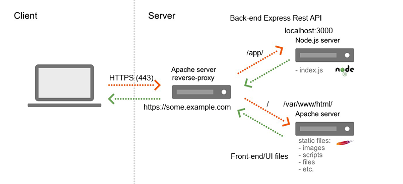

# Application deployment

## Running environment

In server-side applications, the running environment, often referred to as the "runtime environment" or simply the "runtime," is the software and hardware infrastructure where the server-side code of an application executes. This environment provides the necessary resources and services for the server-side code to run, handle requests, process data, and generate responses. The choice of a running environment depends on various factors, including the programming language, framework, and the specific requirements of the application.

- **Server hardware**: The physical or virtual server where the application runs. It includes CPU, memory (RAM), storage (disk space), and network connectivity. The server hardware's capacity and configuration impact the application's performance and scalability.
- **Operating system (OS)**: The server typically runs on an operating system (OS), such as Linux, Windows Server, or macOS Server. The OS manages system resources, handles hardware communication, and provides a platform for running software.
- **Web server**: In web applications, a web server software (e.g., Apache, Nginx, IIS) often serves as an intermediary between client requests and the server-side application. It handles tasks like request routing, load balancing, and static file serving.
- **Runtime for the programming language**: The specific runtime environment for the chosen programming language. For example:
  - For Python applications, the Python runtime environment is necessary, which includes the Python interpreter.
  - For Java applications, the Java Virtual Machine (JVM) serves as the runtime environment.
  - For Node.js applications, the Node.js runtime environment is required.
  - For PHP applications, the PHP interpreter is used.
- **Application server (optional)**: In some cases, like with Java-based applications, an application server like Tomcat, WildFly, or WebSphere may be used. It provides additional services like connection pooling, transaction management, and security. With node.js the pm2 process manager can be used for similar purposes.
- **Database server**: If the application interacts with a database, a database server (e.g., MySQL, PostgreSQL, MongoDB) is part of the runtime environment. It manages data storage, retrieval, and manipulation.
- **Frameworks & middleware**: Middleware components and frameworks used to develop the server-side application. These may include web frameworks (e.g., Flask, Ruby on Rails, Express.js), message brokers (e.g., RabbitMQ), and caching systems (e.g., Redis).
- **Environment variables and configuration**: Settings and configuration parameters that control the behavior of the application. These may include database connection strings, API keys, and other environment-specific variables. These values usually differ between development, testing, and production environments.
- **Security components**: Security measures like firewalls, intrusion detection systems, and encryption protocols that protect the server and its data.
- **Monitoring and logging tools**: Tools and services that help monitor the server's performance, track errors, and log application events for debugging and analysis.
- **Load balancers (for scalability)**: In a high-traffic environment, load balancers distribute incoming requests across multiple servers to ensure scalability and high availability.
- **Containerization and orchestration (e.g., Docker, Kubernetes)**: In modern server environments, containerization technologies and orchestration platforms are used to package, deploy, and manage applications and their dependencies in a consistent and scalable manner.

The choice of the running environment components depends on factors like the type of application, expected traffic, scalability requirements, and the technology stack being used. Designing a robust and efficient running environment is essential for ensuring the reliable operation of server-side applications.

## Cloud services and environments

Cloud computing models provide different levels of control, flexibility, and management. The three primary models are:

1. **Software as a Service (SaaS)**
   - SaaS delivers software applications over the internet, on a subscription basis. The applications are hosted and managed by the service provider.
   - End-users can use the software but don't manage the infrastructure or platform running the application.
   - Examples: Google Workspace, Microsoft Office 365, Salesforce, Dropbox.
   - Ideal for businesses that want ready-to-use applications without worrying about installation, maintenance, or infrastructure.
2. **Platform as a Service (PaaS)**
   - PaaS provides a platform allowing customers to develop, run, and manage applications without the complexity of building and maintaining the infrastructure typically associated with developing and launching an app.
   - Users manage applications and data, while the provider manages runtime, middleware, operating system, virtualization, servers, storage, and networking.
   - Examples: Heroku, Google App Engine, Microsoft Azure App Services.
   - Suitable for developers who want to focus on their software and data without dealing with servers, storage, and networking.
3. **Infrastructure as a Service (IaaS)**
   - IaaS provides fundamental computing resources such as virtual machines, storage, and networks over the internet. Users have control over their infrastructure, similar to traditional physical data centers, but it's available over the cloud.
   - Users have control over operating systems, storage, deployed applications, and possibly limited control of select networking components (e.g., host firewalls).
   - Examples: Amazon Web Services (AWS), Microsoft Azure, Google Compute Engine (GCE).
   - Ideal for companies needing complete control over their infrastructure but want to avoid the cost and complexity of managing physical servers.

>SaaS is like renting a house - you use it as it is, without worrying about maintaining it.
PaaS is like renting the land and building your house - you control the house but not the land it’s on.
IaaS is like leasing/buying a plot of land - you have full control over the land and what you build on it, but you don’t own the land.

## Security considerations

When deploying applications to a server environment, security is a critical concern. Here are some key security considerations for server-side applications:

1. **[HTTPS](https://en.wikipedia.org/wiki/HTTPS) (SSL/TLS) for Communication**
   - HTTP over [TLS/SSL](https://en.wikipedia.org/wiki/Transport_Layer_Security) (TLS is the new progression of SSL but the _term_ SSL is still generally used)
   - [SSL certificate](https://www.kaspersky.com/resource-center/definitions/what-is-a-ssl-certificate) _authenticates_ a website's identity and enables an encrypted connection
   - Protection of the _privacy_ and _integrity_ of the exchanged data
   - Always use HTTPS to encrypt data in transit and protect against eavesdropping, man-in-the-middle attacks, and data tampering.
   - All unsecure HTTP connections (port 80) should be automatically redirected to HTTPS (port 443) by using [HTTP status codes](https://www.w3.org/Protocols/rfc2616/rfc2616-sec10.html), the 3XX codes are redirect, 301 means Moved Permanently.
   - (Typically, for localhost development environments secure connections are not needed)
1. **Authentication**
   - Implement strong authentication mechanisms to ensure that only authorized users or systems can access the API.
   - Common methods include API keys, OAuth, JWT (JSON Web Tokens), or other token-based systems.
1. **Authorization**
   - Define and enforce proper access controls to restrict users or systems to only the resources they are allowed to access.
1. **Token Management**
   - If using tokens (such as JWT), ensure proper token validation, expiration checks, and secure storage.
   - Check that the user stored in the token is still valid and has the required permissions.
     - For example, if a user is deleted from the database, their token should no longer be valid.
   - Implement token revocation mechanisms in case of compromised tokens.
     - In practice, this means that the server should keep track of issued tokens and their validity. If a token is compromised, it can be added to a blacklist and rejected by the server.
1. **Secure Data Transmission**
   - Avoid exposing sensitive information in the URL; use request headers or the request body for transmitting sensitive data.
   - Be cautious with query parameters and ensure they do not expose sensitive information.
1. **Data Protection**
   - Protect persistent data
   - Implement strict access control. This includes defining database users and privileges ensuring that users/applications have access only to the data necessary for their role.
   - Encrypt sensitive data (like passwords) in the database and ensure that only authorized individuals can access it.
1. **Input Validation**
   - Validate and sanitize all incoming data to prevent injection attacks, such as SQL injection, NoSQL injection, or script injection.
   - Enforce strong validation for data types, lengths, and formats.
1. **Output Encoding**
   - Encode output data to protect against Cross-Site Scripting (XSS) attacks. HTML, XML, or JSON encoding should be applied depending on the output format.
1. **Error Handling**
   - Provide meaningful error messages to clients without revealing sensitive information.
   - Log errors securely on the server side for monitoring and debugging.
1. **[Same-origin policy (SOP)](https://developer.mozilla.org/en-US/docs/Web/Security/Same-origin_policy) and [Cross-Origin Resource Sharing (CORS)](https://developer.mozilla.org/en-US/docs/Web/HTTP/CORS)**
   - SOP is a security mechanism that restricts how a document or script loaded by one [origin](https://developer.mozilla.org/en-US/docs/Web/Security/Same-origin_policy#definition_of_an_origin) can interact with a resource from another origin.
   - CORS is an HTTP-header based mechanism that allows a server to indicate any origins other than its own from which a browser should permit loading resources.
   - Implement proper CORS headers to control which domains are allowed to access the API if needed.
   - Be restrictive with CORS configurations to prevent unauthorized cross-origin requests.
1. **Rate Limiting**
   - Implement rate limiting to prevent abuse, brute-force attacks, or denial-of-service attacks.
   - Configure sensible rate limits based on the nature of the API.
1. **Logging and Monitoring**
   - Log security-relevant events and regularly monitor logs for suspicious activity.
   - Set up alerts for unusual patterns or potential security incidents.
1. **API Versioning**
   - Consider versioning your API to avoid breaking changes and to allow clients to migrate at their own pace.
1. **Security Headers**
   - Utilize security headers, such as [Content Security Policy (CSP)](https://developer.mozilla.org/en-US/docs/Web/HTTP/CSP) and [Strict-Transport-Security (HSTS)](https://developer.mozilla.org/en-US/docs/Glossary/HSTS), to enhance overall security.
   - Check [Helmet](https://expressjs.com/en/advanced/best-practice-security.html#use-helmet) for Express applications.
1. **Security Reviews and Audits**
   - Regularly conduct security reviews and audits of your API design, code, and infrastructure.
   - Stay informed about security best practices and vulnerabilities relevant to your technology stack.

## Installing a Virtual Server on Azure cloud environmnent (IaaS)

### Materials & links

Browse, read, watch & study:

- [Introduction to Azure fundamentals](https://learn.microsoft.com/en-us/training/modules/intro-to-azure-fundamentals/)
- [Get started with Azure](https://azure.microsoft.com/en-us/get-started/)
- [MS Azure Youtube channel](https://www.youtube.com/channel/UC0m-80FnNY2Qb7obvTL_2fA)
- [Azure portal](https://portal.azure.com/)
- [Azure CLI](https://docs.microsoft.com/en-us/cli/azure/)
- [Azure network security group](https://docs.microsoft.com/en-us/azure/virtual-network/network-security-groups-overview)

Help for Linux usage:

- [Using Linux command line](https://ubuntu.com/tutorials/command-line-for-beginners)
- [The Beginner’s Guide to Nano, the Linux Command-Line Text Editor](https://www.howtogeek.com/42980/the-beginners-guide-to-nano-the-linux-command-line-text-editor/)
- [Ubuntu package management](https://ubuntu.com/server/docs/package-management)
- [Ubuntu firewall](https://ubuntu.com/server/docs/security-firewall)

### Getting started & setting up the environment

1. Sign up for a free [student account](https://azure.microsoft.com/en-us/free/students/) using your school email address & login, you should get some free credits (100 USD), [more info](https://docs.microsoft.com/en-us/azure/education-hub/azure-dev-tools-teaching/program-faq)
1. Go to [Azure portal](https://portal.azure.com/)
1. Create a resource: Virtual machine (VM), use server instance, e.g. latest Ubuntu server LTS)

   - select [VM size](https://docs.microsoft.com/en-us/azure/virtual-machines/sizes) & disks according your needs (Think about what is the minimum for a web server? Check the OS system requirements, etc.)
   - 'Standard_B1ms' is the teacher's recommendation for this course
   - NOTE: you have 100 USD of student credits to spend in total (for a one year)
   - Allow access to SSH, HTTP and HTTPS ports

   

   - Finally hit the _CREATE_ button and wait for the VM deployment to finish
   - After successful deployment of the virtual machine go to the resources's _Overview_ page and configure the _DNS name_ for your public IP address.
   - Note: VM is paid by hour when the VM is running. In development use it's a good idea to stop the VM when you don't need it (start/stop buttons are found in Azure portal).

1. Use SSH connection for managing your VM (`ssh username@PUBLIC_IP/YOUR_DNS_NAME` in terminal/git bash or use e.g. [Putty](https://www.putty.org/))

   - Optional: use public key authentication instead of username/password: [Instructions](https://www.digitalocean.com/community/tutorials/how-to-set-up-ssh-keys-on-ubuntu-22-04)

1. Make sure you have all recent updates installed (this should be done on weekly basis)

   ```bash
   sudo apt update # checks for available updates
   sudo apt dist-upgrade # installs updates including kernel packages
   ```

   All administrator level tasks needs superuser (root) privileges. `sudo` (_superuser do_) needs to used before the actual command for gaining the access rights. Use your login password if prompted.

### Installing & configuring web server software

#### Apache web server

1. Install

   ```sh
   sudo apt update
   sudo apt upgrade
   sudo apt install apache2
   ```

2. Check configuration files `/etc/apache2/` & start `sudo systemctl start apache2`
3. Add write permissions to your user account for the webroot folder `/var/www/html`: `sudo chown <MYUSERNAME>.<GROUP> /var/www/html`
4. Copy your UI files to the webroot using e.g. scp/filezilla/winscp or clone/pull from GitHub
5. Test with browser <http://my.server.ipaddress.or.hostname/>
6. Enable HTTPS connections using Let's encrypt & Certbot

   - [Let’s Encrypt is a free, automated, and open certificate authority (CA)](https://letsencrypt.org/about/)
   - Use the [Certbot](https://certbot.eff.org/) for easy installation:

   ```sh
   # Ensure that your version of snapd is up to date
   sudo snap install core; sudo snap refresh core
   # Install Certbot
   sudo snap install --classic certbot
   # Get a certificate and have Certbot edit your apache configuration automatically to serve it, turning on HTTPS access in a single step
   sudo certbot --apache
   # Answer the questions when prompted, you need to provide your server DNS-name, something like <my.website>.cloudapp.azure.com
   ```

   - To confirm that your site is set up properly, visit <https://yourwebsite.cloudapp.azure.com/> in your browser and look for the lock icon in the URL bar

#### MariaDB database server

1. Install MariaDB server ([more detailed instructions](https://www.digitalocean.com/community/tutorials/how-to-install-mariadb-on-ubuntu-22-04)):

   ```bash
   sudo apt install mariadb-server
   ```

1. Start and enable it:

   ```bash
   sudo systemctl start mariadb
   sudo systemctl enable mariadb
   ```

1. Secure it by running the sript (optional in our one server system):

   ```console
   mysql_secure_installation
   ```

   Note: In Ubuntu you don't necessary need root password at all. Just use sudo for gaining root access: `sudo mysql -u root`. Skip that step when prompted.

1. Connect to your database server as a root user: `sudo mysql -u root` and create a database and a user with privileges on it:

   ```sql
   CREATE DATABASE HealthDiary;
   CREATE USER 'myusername'@'localhost' IDENTIFIED BY 'mypassword';
   GRANT ALL PRIVILEGES ON `HealthDiary`.* TO 'myusername'@'localhost';
   FLUSH PRIVILEGES;
   ```

   (in case you would need outside access (e.g. during project, separate database server from app server), replace `localhost` with `'%'` in the two GRANT queries and remember that the settings you did with `mysql_secure_installation` may prevent this).

1. Use your own database creation script or download the [health-diary-db.sql](./assets/health-diary-db.sql) example SQL script. Can be done directly from server using curl: `curl -O <FILE-URL>` (note: click the _Raw_ button on script's GitHub page in order to get a working url) or downloaded at first to your local computer and then uploaded with any SCP file transfer tool to the server. (e.g. using command line secure copy tool **scp**: `scp health-diary-db.sql <YOUR-USERNAME>@<YOUR-SERVE-NAME/IP>:`)
   - Alternatively, you can just copy paste the contents of the file to mysql client on the server.
1. Import the tables and insert the data: `mysql -u myusername -p < health-diary-db.sql` or `sudo mysql < health-diary-db.sql`
1. Eventually check that the user account works and the data is there: `mysql -u myusername -p`

   ```sql
   USE HealthDiary;
   SHOW TABLES;
   SELECT * FROM Users;
   exit
   ```

1. (Optional) if you would like to install phpMyAdmin to administrate your databases, tables and data with a graphical user interface, check for example [instructions here](https://www.digitalocean.com/community/tutorials/how-to-install-and-secure-phpmyadmin-on-ubuntu-22-04)

#### Node.js runtime and process management



1. Install _node.js_ and _npm_  from [nodesource package repository](https://github.com/nodesource/distributions#ubuntu-versions):

   ```bash
   curl -fsSL https://deb.nodesource.com/setup_lts.x | sudo -E bash - &&\
   sudo apt install -y nodejs
   # check that the installed tools are working:
   node -v
   npm -v
   ```

1. Configure Apache httpd server as a reverse proxy to Node server:

   1. Edit the Apache configuration (Let's encrypt's default SSL configuration file):

      ```bash
      sudo nano /etc/apache2/sites-available/000-default-le-ssl.conf
      ```

   1. Add the following content (to the bottom of `<VirtualHost *:443>` block) & save the conf file:

      ```conf
      <VirtualHost *:443>
        
        # some existing conf stuff here
        ...
        ...

        # Choose only one of the following options:

        # conf for URL subpath, e.g.: https://myserver.example.com/api/ <-> localhost:3000
        #ProxyPreserveHost On
        #ProxyPass /api/ http://127.0.0.1:3000/
        #ProxyPassReverse /api/ http://127.0.0.1:3000/

        # OR conf for root path: https://myserver.example.com/ <-> localhost:3000
        ProxyPreserveHost On
        ProxyPass / http://127.0.0.1:3000/
        ProxyPassReverse / http://127.0.0.1:3000/

      </VirtualHost>
      ```

1. When working with Ubuntu 22.04 default installation you need to enable modules `proxy` and `proxy_http` by using command `sudo a2enmod <MODULE-NAME>` and restart the web server:

   ```bash
   sudo a2enmod proxy proxy_http
   sudo systemctl restart apache2
   ```

1. Setup Git and connect to your remote repository

   1. [Install Git on Ubuntu 22.04](https://www.digitalocean.com/community/tutorials/how-to-install-git-on-ubuntu-22-04)
   1. [Generate a new SSH key](https://docs.github.com/en/authentication/connecting-to-github-with-ssh/generating-a-new-ssh-key-and-adding-it-to-the-ssh-agent)
   1. [Add SSH key to your GitHub account](https://docs.github.com/en/authentication/connecting-to-github-with-ssh/adding-a-new-ssh-key-to-your-github-account)
   1. [Test connection](https://docs.github.com/en/authentication/connecting-to-github-with-ssh/testing-your-ssh-connection)

1. Install and run your Express application:

   1. Read [Production best practices: performance and reliability](https://expressjs.com/en/advanced/best-practice-performance.html) and [What is NODE_ENV in Node.js](https://www.geeksforgeeks.org/what-is-node_env-in-node-js/)
      - Prepare your app for production and create a new git branch `deployment` or use `main`
   1. Make sure you are in your home folder: `cd`
   1. `git clone <your-github-repo-url-here>` (or copy your back-end app to your home folder on the server exluding the contents of `node_modules` & `uploads` folders)
   1. Go to the app directory: `cd <my-app>`
   1. If you cloned the repo, make sure that you are in the right branch (`git checkout <branchname>` if not)
   1. Install your dependencies: `npm install --production` (`--production` flag is used to avoid installing development dependencies if not needed on deployment server)
   1. Create/edit `.env` file (see `.env.sample`) with your db credentials (you set in [MariaDB](#mariadb-database-server)) and other settings:

      ```conf
      DB_HOST=127.0.0.1
      DB_USER=<your-db-user>
      DB_PASSWORD=<your-db-user_password>
      DB_NAME=<your-db-name>
      JWT_SECRET=somesecuresecrethere
      JWT_EXPIRES_IN=1d
      # and other settings that you may have in your app
      ...
      ```

   1. For quick testing, start your application: `node src/index.js` or `npm start`
   1. To kill the app, use `CTRL+C`, or if no more hanging in your terminal session, try `pkill node` or use `top`
   1. Test: open a browser and visit `https://<your-ip-address-or-hostname>/api/<endpoint>`
   1. To have your app running "forever" as a background service, featuring automatic restart on crash, use e.g. [pm2](https://pm2.keymetrics.io/):

      ```sh
      sudo npm install -g pm2
      pm2 start src/index.js --name <MY-SERVER-APP-NAME>
      ```

   1. to check the status of running node apps, run `pm2 status`
   1. to check for possible errors log files can be accessed with `pm2 logs`
   1. restart app after code updates: `pm2 restart <app-name>`
   1. if you want that the app automatically reload on change (e.g. on next `git pull`), use the `--watch` flag.
   1. (optional) "pure" linux option could be using [systemd](https://nodesource.com/blog/running-your-node-js-app-with-systemd-part-1/) for creating a system process.

#### Publishing Front-end application (Client)

Front-end HTML/CSS/JS files can be served from any web server. **Easiest solution** is to use the [Express static](https://expressjs.com/en/starter/static-files.html) files serving option. Then you don't need care about cors issues and the apache proxy setup done earlier works out-of-the-box. For example when using Vite for front-end development:

1. Build the app by following [these instructions](./01-tools-env.md#publishing-the-website-created-with-vite)
   - **Note:** Remember to update your API connections (`fetch()` function calls) in your client code to use the real server's URL address instead of `localhost:3000`!
1. Copy all contents of `dist/` folder to you node application's `public/` folder on the server.
1. Test: open a browser and visit `https://<your-server-address>/` and `https://<your-server-address>/api/`

**If** you want to use the Apache directly as a web server for static files:

1. Change the owner of the web root folder such that no `sudo` permissions are needed when you edit the contents of the folder: `sudo chown <USERNAME>.<USERNAME> /var/www/html`
1. Upload/copy/clone your front-end files to the server's `/var/www/html/` directory
1. Update Apache config by enabling `DocumentRoot` and modifying proxy settings for Node app to use the sub url path version
1. Test: open a browser and visit `https://<your-server-address>/` and `https://<your-server-address>/api/`

#### Cross-Origin Resource Sharing (CORS)

If running the front-end and back-end on different servers, you need to take care of [CORS](https://developer.mozilla.org/en-US/docs/Web/HTTP/CORS) issues. One option is to use the [cors](https://github.com/expressjs/cors#readme) middleware [in Express](https://expressjs.com/en/resources/middleware/cors.html) app.

## Assignment - Deploy your application to Azure

Follow the instructions above to deploy your application to an Azure virtual machine.

**Returning:** No separate return is needed. This is part of your individual project work.
